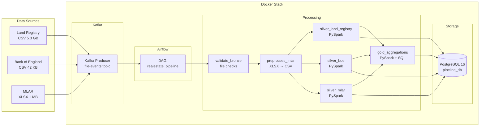

# UK Real Estate Pipeline v2

## Table of Contents

- [1. Introduction](#1-introduction)
- [2. Data Sources](#2-data-sources)
- [3. Architecture](#3-architecture)
- [4. Prerequisites and Setup](#4-prerequisites-and-setup)
- [5. Running the Pipeline](#5-running-the-pipeline)
- [6. Incremental vs. Full Processing](#6-incremental-vs-full-processing)
- [7. Airflow DAG](#7-airflow-dag)
- [8. Data Lineage Verification](#8-data-lineage-verification)
- [9. Notes and Conclusions](#9-notes-and-conclusions)
- [10. Project Structure](#10-project-structure)

---

## 1. Introduction

This project is the second iteration of a UK real estate data pipeline, built for the Big Data course (BGD) at PJATK. The first version ([realestate-elt](https://github.com/s24350/realestate-elt)) implemented a medallion architecture using pure SQL in PostgreSQL — all transformations (type casting, NULL handling, aggregation) were done via SQL scripts executed manually against the database, with data loaded using PostgreSQL `COPY`.

This version replaces the SQL-based approach with a fully orchestrated pipeline:
- **PySpark** handles all transformations (type casting, unit conversion, NULL handling, temporal column derivation)
- **Apache Airflow** orchestrates the entire workflow as a DAG with dependency management and parallel execution
- **Apache Kafka** provides a file-event notification layer for data arrival signaling
- **Docker** containerizes all services (PostgreSQL, Airflow, Kafka, Zookeeper, Spark)
- The **medallion architecture** is preserved (Bronze → Silver → Gold) but with key logic changes: type casting and unit conversion now happen in Silver (not Gold), and aggregations remain in Gold

---

## 2. Data Sources

Three UK public datasets are used. All files are placed in subdirectories under `data/` (excluded from git via `.gitignore`).

### 2.1. Land Registry — Price Paid Data

**Directory:** `data/land_registry/`
**Files:**
- `pp-complete.csv` (~5.3 GB) — full transaction history, used in full mode
- `pp-monthly-update-new-version.csv` (~15 MB) — current month only, used in incremental mode

**Download:** https://www.gov.uk/government/statistical-data-sets/price-paid-data-downloads → "Single file CSV" and "Monthly update"

Each row is a property transaction with a unique GUID, date, price, address, and property type. Data spans from January 1995 to present.

**Design note:** in incremental mode, only transactions from quarters *after* the watermark are processed. If the monthly update file contains new transactions from an already-processed quarter (same quarter, new GUIDs), these are only picked up in full mode. This is a known design limitation documented in the incremental processing section.

### 2.2. Bank of England — Lending to Individuals (Monthly)

**Directory:** `data/boe/`
**File:** `Bank of England  Database.csv` (~42 KB)

**Download:** https://www.bankofengland.co.uk/boeapps/database/fromshowcolumns.asp → A5.4 series → "Export source data to csv"

Monthly mortgage approval counts from 1993 onwards. Column headers contain long descriptions ending with series codes (e.g. `LPMB3VA`, `LPMB3C8`). The silver transform maps these codes to friendly names like `mfi_house_purchase`, `total_secured_lending`. The codes carry business meaning and are preserved in gold column names (e.g. `boe_total_secured_lending__LPMB3C8__count`).

### 2.3. MLAR — Mortgage Lenders & Administrators Return (Quarterly)

**Directory:** `data/mlar/`
**Files:**
- `mlar-longrun-detailed.XLSX` (~1 MB) — raw source
- `mlar_1_21.csv`, `mlar_1_32.csv`, `mlar_1_33.csv` — generated by `mlar_parser.py`

**Download:** https://www.bankofengland.co.uk/statistics/details/further-details-about-mortgage-lenders-and-administrators-statistics-data → "view the data"

The XLSX contains pivot-table-formatted data with multi-row headers. A preprocessing script (`mlar_parser.py`) converts three worksheets (1.21 — business flows, 1.32 — nature of loan, 1.33 — purpose of loan) into flat CSVs using mapping files (`preprocessing/mappings/`). The gold layer references specific categories using MLAR codes like `MLAR_1_21_C_1` (sheet 1.21, section C, row 1), which correspond to positions in the original Excel workbook.

Monetary values in sheets 1.21 and 1.33 are in millions of pounds (£m) in the source. The silver transform multiplies these by 1,000,000 to store full GBP values, ensuring all monetary values across all three sources are in the same unit.

---

## 3. Architecture

The pipeline follows the medallion pattern with Airflow orchestration, Kafka event signaling, and PySpark transformations. All services run in Docker containers.



**Component roles:**

- **Bronze layer** — raw source files on disk, validated by `validate_bronze.py` (no copy, no transformation)
- **Kafka** — publishes JSON events (`file_available`) when data files are detected. Demonstrates event-driven ingestion; the DAG is currently triggered manually
- **MLAR preprocessor** — converts the semi-structured XLSX into three flat CSVs using pandas + mapping files
- **Silver layer** — PySpark reads source CSVs, applies type casting (via `try_cast`), NULL normalization, temporal column derivation (`quarter_start`, `quarter_label`), and unit conversion (MLAR ×1M). Writes to PostgreSQL via JDBC staging table + upsert (`INSERT ... ON CONFLICT DO UPDATE`)
- **Gold layer** — reads from silver tables, aggregates Land Registry to quarter level (pushes aggregation to PostgreSQL for performance), averages BoE monthly data to quarters, pivots selected MLAR categories. Joins all three on `quarter_start` via `FULL OUTER JOIN`
- **Watermark** — `meta.watermark` table tracks the last processed quarter per source. Incremental mode only processes data newer than the watermark

---

## 4. Prerequisites and Setup

- Docker Desktop (with at least 6 GB RAM allocated)
- Git
- PostgreSQL JDBC driver: download `postgresql-42.7.3.jar` from https://jdbc.postgresql.org/download/ and place in `jars/`

```bash
# 1. Clone the repo
git clone https://github.com/s24350/realestate-pipeline.git
cd realestate-pipeline

# 2. Place source data files in their directories
#    data/land_registry/pp-complete.csv
#    data/land_registry/pp-monthly-update-new-version.csv
#    data/boe/Bank of England  Database.csv
#    data/mlar/mlar-longrun-detailed.XLSX

# 3. Build and start all containers
cd docker
docker compose up --build -d

# 4. Wait ~60 seconds, then open Airflow UI:
#    http://localhost:8080  (admin / admin)
```

---

## 5. Running the Pipeline

### Full load (first run or reprocess everything)

In the Airflow UI: DAGs → `realestate_pipeline` → Play button (▶) → "Trigger DAG w/ config":
```json
{"mode": "full"}
```

This processes all source files end-to-end. The Land Registry silver task takes approximately 49 minutes on a modern laptop (Intel Ultra 7, 32 GB RAM, Docker/WSL2). All writes use upsert — running full mode multiple times with the same data produces identical results (idempotent).

### Incremental load (new data added)

```json
{"mode": "incremental"}
```

Only data newer than the stored watermark is processed. See the next section for details on how to prepare each source for incremental processing.

### Manual execution (without Airflow, for testing)

```bash
docker exec -it <scheduler-container> bash
cd /opt/airflow
python -m bronze.ingest_bronze
python -m silver.silver_boe --mode full
python -m silver.silver_mlar --mode full
python -m silver.silver_land_registry --mode full
python -m gold.gold_aggregations --mode full
```

Note: use `python -m` (module mode) so Python can resolve `utils.*` imports correctly.

---

## 6. Incremental vs. Full Processing

The pipeline supports two modes, controlled by a DAG parameter:

| Mode | What it does | When to use |
|------|-------------|-------------|
| `full` | Upserts all available data from all sources | First run, or when source files contain backdated corrections |
| `incremental` | Only processes data where `quarter_start > watermark` | Regular updates with new data |

### How to prepare each source for incremental processing

**Bank of England:** replace `data/boe/Bank of England  Database.csv` with a newer export that contains additional rows. The watermark filters by `month_start`.

**MLAR:** replace `data/mlar/mlar-longrun-detailed.XLSX` with a version containing a new quarter column, then delete the three CSV files so the parser regenerates them:
```bash
rm data/mlar/mlar_1_21.csv data/mlar/mlar_1_32.csv data/mlar/mlar_1_33.csv
```

**Land Registry:** the incremental mode automatically reads `pp-monthly-update-new-version.csv` (if it exists) instead of the full 5 GB file. Replace it with the latest monthly update from the Land Registry website.

### Design limitation

The watermark uses strict greater-than filtering (`quarter_start > watermark`). If a source file contains new transactions from an already-processed quarter (e.g. new GUIDs with dates in Q1 2026 when Q1 2026 was already loaded), these are skipped in incremental mode. Run full mode to pick them up. This is standard practice in production pipelines — the watermark is conservative by design.

---

## 7. Airflow DAG

The DAG `realestate_pipeline` orchestrates all pipeline tasks with proper dependency management. Silver tasks for the three sources run in parallel after preprocessing, and gold aggregation runs after all silver tasks complete.


Task execution order:
```
publish_file_events → validate_bronze → init_schemas → preprocess_mlar
                                                             ↓
                                silver_land_registry ←───────┤
                                silver_boe           ←───────┤  (parallel)
                                silver_mlar          ←───────┘
                                         ↓
                                gold_aggregations
```

---

## 8. Data Lineage Verification

A complete trace from raw CSV to gold for one transaction:

**Raw CSV** (`pp-complete.csv`, row 1):
```
{2A289E9F-6BB5-CDC8-E050-A8C063054829}, 36995, 1995-03-24
```

**Silver** (`silver.land_registry_clean`):
```
transaction_id: 2A289E9F-6BB5-CDC8-E050-A8C063054829
price_gbp: 36995.00, transfer_date: 1995-03-24
quarter_start: 1995-01-01, quarter_label: 1995Q1, property_type: F
```

**Gold** (`gold.housing_credit_summary`, quarter 1995Q1):
```
transactions_total__LR__count: 172,668
price_avg__LR__gbp: 66,496.64
```

Cross-check: `SELECT COUNT(*) FROM silver.land_registry_clean WHERE quarter_label = '1995Q1'` returns 172,668 — exact match.

---

## 9. Notes and Conclusions

### SQL v1 vs. PySpark v2 comparison

A direct performance comparison between the two versions is not straightforward because the processing logic changed significantly. In v1, the Land Registry data was loaded into PostgreSQL via `COPY` (approximately 5–8 minutes for the raw load), and all transformations — type casting, NULL handling, aggregation — were performed as SQL queries against the database. In v2, PySpark reads the CSV, performs all transformations in-memory, and writes the results to PostgreSQL via JDBC. The silver Land Registry task takes approximately 49 minutes end-to-end in Airflow, with the bulk of that time spent on the JDBC write (31 million rows through a staging table and upsert). The aggregation logic also shifted: v1 performed unit conversion (MLAR ×1M) and some temporal derivations in the gold layer, while v2 moves all of this to silver. This means v2's silver is heavier and gold is lighter — a deliberate design choice that keeps the gold layer focused purely on joining and aggregating pre-cleaned data.

### Idempotency

All loads use `INSERT ... ON CONFLICT DO UPDATE` (PostgreSQL upsert). Tables are never dropped or truncated during pipeline execution. Running the full pipeline N times with identical input data produces the same result in Silver and Gold — verified by comparing row counts before and after repeated full runs.

### Parallel processing

The Airflow DAG executes the three silver tasks (Land Registry, BoE, MLAR) in parallel after the preprocessing step. This is visible in the DAG graph and reduces total pipeline time compared to sequential execution — BoE and MLAR complete in under 30 seconds each while Land Registry runs for ~49 minutes.

### Key technical challenges solved

1. **BoE date parsing** — the CSV uses 2-digit years (`31 Jan 26`), which PySpark's `to_date` interprets incorrectly (year 2099). Solved by manually prepending the century (`19xx` for years 31–99, `20xx` for 00–30) before parsing.
2. **PySpark version compatibility** — `try_cast` is not available as a Python function in PySpark 3.5 (added in 4.0), but works as a SQL expression via `F.expr("try_cast(col as type)")`.
3. **PostgreSQL case sensitivity** — Spark writes column names with mixed case (e.g. `transactions_total__LR__count`), but PostgreSQL lowercases unquoted identifiers. Solved by quoting column names in the DDL and upsert SQL.
4. **JDBC write performance** — writing 31M rows via JDBC caused Spark heartbeat timeouts. Solved by increasing `spark.network.timeout` to 800s, `spark.executor.heartbeatInterval` to 120s, driver memory to 4 GB, and adding `batchsize=10000` to the JDBC write.
5. **Gold layer memory** — reading 31M Land Registry rows into Spark for aggregation caused JVM crashes. Solved by pushing the aggregation down to PostgreSQL as a JDBC subquery, so Spark only receives ~125 pre-aggregated rows.

---

## 10. Project Structure

```
realestate-pipeline/
├── dags/                  Airflow DAG definition
│   └── realestate_dag.py
├── ingestion/             Kafka producer (file-events)
│   └── kafka_producer.py
├── preprocessing/         MLAR XLSX → CSV parser
│   ├── mlar_parser.py
│   └── mappings/          Category label mappings per sheet
├── bronze/                Source file validation
│   └── ingest_bronze.py
├── silver/                PySpark silver transforms
│   ├── silver_land_registry.py
│   ├── silver_boe.py
│   └── silver_mlar.py
├── gold/                  PySpark + SQL gold aggregation
│   └── gold_aggregations.py
├── utils/                 Shared utilities
│   ├── config.py          Central configuration (env vars)
│   ├── db.py              PostgreSQL connection helpers
│   ├── spark_session.py   SparkSession factory
│   └── watermark.py       Incremental processing state
├── sql/                   DDL scripts
│   └── init_schemas.sql
├── docker/                Docker configuration
│   ├── docker-compose.yml
│   ├── Dockerfile.airflow
│   └── init-postgres.sql
├── data/                  Source data files (not in git)
│   ├── land_registry/     pp-complete.csv, monthly update
│   ├── boe/               Bank of England CSV
│   └── mlar/              XLSX + generated CSVs
├── jars/                  JDBC driver (not in git)
├── docs/                  Architecture diagrams, screenshots
└── requirements.txt
```

---

*Last updated: April 2026*
