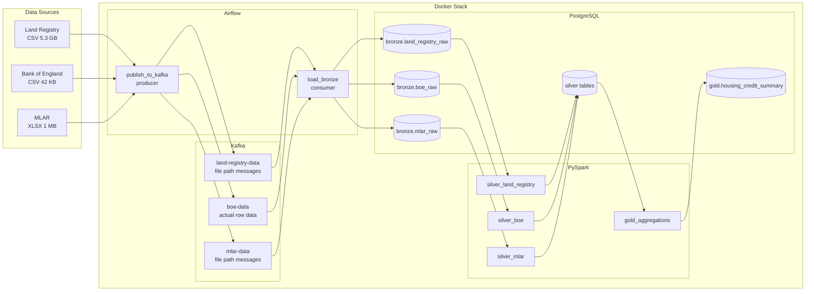
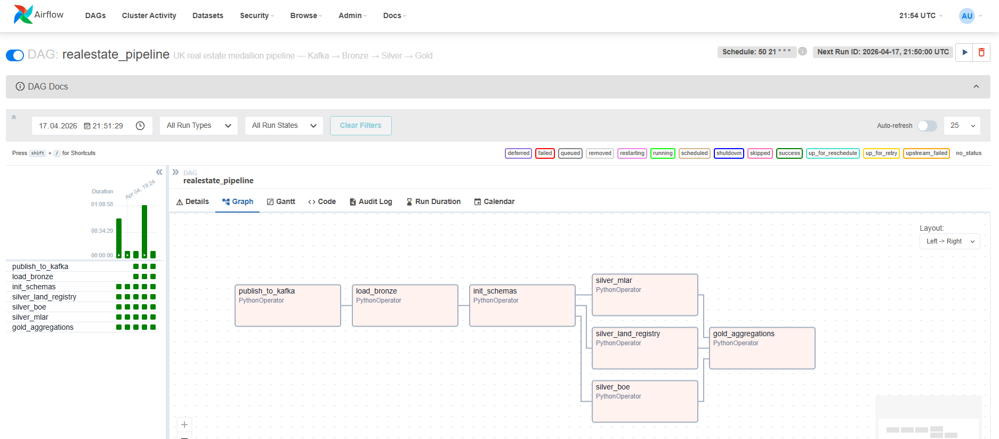

# UK Real Estate Pipeline v2

## Table of Contents

- [1. Introduction](#1-introduction)
- [2. Data Sources](#2-data-sources)
- [3. Architecture](#3-architecture)
- [4. Prerequisites and Setup](#4-prerequisites-and-setup)
- [5. Running the Pipeline](#5-running-the-pipeline)
- [6. Incremental vs. Full Processing](#6-incremental-vs-full-processing)
- [7. Airflow DAG](#7-airflow-dag)
- [8. Data Lineage Verification](#8-data-lineage-verification)
- [9. Notes and Conclusions](#9-notes-and-conclusions)
- [10. Project Structure](#10-project-structure)

---

## 1. Introduction

This project is the second iteration of a UK real estate data pipeline, built for the Big Data course (BGD) at PJATK. The first version ([realestate-elt](https://github.com/s24350/realestate-elt)) implemented a medallion architecture using pure SQL in PostgreSQL — all transformations (type casting, NULL handling, aggregation) were done via SQL scripts executed manually against the database, with data loaded using PostgreSQL `COPY`.

This version replaces the SQL-based approach with a fully orchestrated pipeline:
- **PySpark** handles all transformations (type casting, unit conversion, NULL handling, temporal column derivation)
- **Apache Airflow** orchestrates the entire workflow as a DAG with dependency management, parallel execution, and scheduled triggers
- **Apache Kafka** serves as the single entry point for all data — every file passes through source-specific Kafka topics before reaching the bronze layer
- **Docker** containerizes all services (PostgreSQL, Airflow, Kafka, Zookeeper, Spark)
- The **medallion architecture** is preserved (Bronze → Silver → Gold) with the bronze layer now stored in PostgreSQL (raw TEXT tables loaded via COPY), silver performing all transformations via PySpark, and gold focused purely on aggregation and joining

The project evolved through two phases. The first phase (tagged as `v1.0-orchestration`) established the Airflow DAG, PySpark silver/gold transforms, and basic Kafka file-event publishing. The second phase introduced Kafka as a genuine single entry point for data ingestion, moved the bronze layer from CSV files on disk to PostgreSQL tables, refined the watermark to per-source granularity (date for Land Registry, month for BoE, quarter for MLAR), and added scheduled automatic triggering.

---

## 2. Data Sources

Three UK public datasets are used. All files are placed in subdirectories under `data/` (excluded from git via `.gitignore`).

### 2.1. Land Registry — Price Paid Data

**Directory:** `data/land_registry/`
**Files:**
- `pp-complete.csv` (~5.3 GB) — full transaction history, used in full mode
- `pp-monthly-update-new-version.csv` (~15 MB) — current month only, used in incremental mode

**Download:** https://www.gov.uk/government/statistical-data-sets/price-paid-data-downloads → "Single file CSV" and "Monthly update"

Each row is a property transaction with a unique GUID, date, price, address, and property type. Data spans from January 1995 to present. Neither file contains a header row — columns are positional.

### 2.2. Bank of England — Lending to Individuals (Monthly)

**Directory:** `data/boe/`
**File:** `Bank of England  Database.csv` (~42 KB)

**Download:** https://www.bankofengland.co.uk/boeapps/database/fromshowcolumns.asp → A5.4 series → "Export source data to csv"

Monthly mortgage approval counts from 1993 onwards. Column headers contain long descriptions ending with series codes (e.g. `LPMB3VA`, `LPMB3C8`). The silver transform maps these codes to friendly names like `mfi_house_purchase`, `total_secured_lending`. The codes carry business meaning and are preserved in gold column names (e.g. `boe_total_secured_lending__LPMB3C8__count`).

In the Kafka flow, BoE data is published as actual row data through the `boe-data` topic (not as a file path), demonstrating real data-through-queue ingestion.

### 2.3. MLAR — Mortgage Lenders & Administrators Return (Quarterly)

**Directory:** `data/mlar/`
**Files:**
- `mlar-longrun-detailed.XLSX` (~1 MB) — raw source
- `mlar_long_raw.csv` — generated by `mlar_parser.py` (long format)

**Download:** https://www.bankofengland.co.uk/statistics/details/further-details-about-mortgage-lenders-and-administrators-statistics-data → "view the data"

The XLSX contains pivot-table-formatted data with multi-row headers. A preprocessing script (`mlar_parser.py`) converts three worksheets (1.21 — business flows, 1.32 — nature of loan, 1.33 — purpose of loan) into a single long-format CSV (`src, category, quarter, value`) using mapping files (`preprocessing/mappings/`). This transposition at preprocessing time means the bronze table has a fixed 4-column schema regardless of how many quarters the data covers — new quarters add rows, not columns.

The gold layer references specific categories using MLAR codes like `MLAR_1_21_C_1` (sheet 1.21, section C, row 1), which correspond to positions in the original Excel workbook. Monetary values in sheets 1.21 and 1.33 are in millions of pounds (£m) in the source. The silver transform multiplies these by 1,000,000 to store full GBP values.

---

## 3. Architecture

The pipeline follows the medallion pattern with Kafka as the single entry point, Airflow orchestration, PySpark transformations, and PostgreSQL storage. All services run in Docker containers.



**Component roles:**

- **Kafka (single entry point)** — all data enters the pipeline through three source-specific topics. The producer scans `data/` directories, checks the `meta.file_registry` table for changes, and publishes events. For BoE, the actual CSV row data flows through Kafka (demonstrating data-through-queue). For Land Registry and MLAR, file path messages are published (files are too large for row-level streaming). The consumer reads from all three topics and loads data into bronze PostgreSQL tables.

- **Bronze layer (PostgreSQL)** — three raw tables (`land_registry_raw`, `boe_raw`, `mlar_raw`), all columns TEXT. Loaded via PostgreSQL `COPY` (for file-path messages) or direct INSERT (for BoE row data from Kafka). Full mode uses TRUNCATE + COPY for Land Registry; all other loads use staging table + `INSERT WHERE NOT EXISTS` to avoid duplicates and comply with the no-drop-tables policy.

- **File registry** — `meta.file_registry` tracks file size and modification time per source. In incremental mode, unchanged files are skipped entirely — the producer publishes nothing, the consumer receives nothing, and the DAG completes in seconds.

- **Silver layer (PySpark)** — reads from bronze PostgreSQL via JDBC. Applies type casting (via `try_cast`), NULL normalization, temporal column derivation (`quarter_start`, `quarter_label`), and unit conversion (MLAR ×1M). Writes to silver PostgreSQL via staging table + upsert (`INSERT ... ON CONFLICT DO UPDATE`). Land Registry uses partitioned JDBC reads (16 partitions by date) to handle 31M rows without out-of-memory crashes.

- **Gold layer (PySpark + SQL)** — reads from silver tables, aggregates Land Registry to quarter level (pushes aggregation to PostgreSQL as a JDBC subquery for performance — Spark receives ~132 rows, not 31M), averages BoE monthly data to quarters, pivots selected MLAR categories. Joins all three on `quarter_start` via `FULL OUTER JOIN`.

- **Watermark** — `meta.watermark` table tracks the last processed value per source with per-source granularity: `MAX(transfer_date)` for Land Registry (date-level), `MAX(month_start)` for BoE (month-level), `MAX(quarter_start)` for MLAR (quarter-level). Incremental mode only processes data newer than the watermark.

---

## 4. Prerequisites and Setup

- Docker Desktop (with at least 8 GB RAM allocated)
- Git
- PostgreSQL JDBC driver: download `postgresql-42.7.3.jar` from https://jdbc.postgresql.org/download/ and place in `jars/`

```bash
# 1. Clone the repo
git clone https://github.com/s24350/realestate-pipeline.git
cd realestate-pipeline

# 2. Place source data files in their directories
#    data/land_registry/pp-complete.csv
#    data/land_registry/pp-monthly-update-new-version.csv  (optional, for incremental)
#    data/boe/Bank of England  Database.csv
#    data/mlar/mlar-longrun-detailed.XLSX

# 3. Build and start all containers
cd docker
docker compose up --build -d

# 4. Wait ~60 seconds, then open Airflow UI:
#    http://localhost:8080  (admin / admin)
```

---

## 5. Running the Pipeline

The pipeline supports three trigger modes:

### Full load (first run or reprocess everything)

In the Airflow UI: DAGs → `realestate_pipeline` → Play button (▶) → "Trigger DAG w/ config":
```json
{"mode": "full"}
```

This processes all source files end-to-end. The Land Registry silver task takes approximately 45 minutes on a modern laptop (Intel Ultra 7, 32 GB RAM, Docker/WSL2). All writes use upsert — running full mode multiple times with the same data produces identical results (idempotent).

### Incremental load (new data added)

```json
{"mode": "incremental"}
```

Only data newer than the stored watermark is processed. The producer checks the file registry and skips unchanged files. If no files changed, the entire DAG completes in seconds.

### Scheduled automatic trigger

The DAG includes a `schedule_interval` (configurable, default `@daily`). Scheduled runs always use incremental mode. The producer scans for file changes, publishes to Kafka if anything changed, and the pipeline processes only new data. If nothing changed, the DAG detects this via XCom and skips the consumer entirely.

### Manual execution (without Airflow, for testing)

```bash
docker exec -it <scheduler-container> bash
cd /opt/airflow
python -m ingestion.kafka_producer --mode full
python -m ingestion.kafka_consumer
python -m silver.silver_boe --mode full
python -m silver.silver_mlar --mode full
python -m silver.silver_land_registry --mode full
python -m gold.gold_aggregations --mode full
```

Note: use `python -m` (module mode) so Python can resolve `utils.*` imports correctly.

---

## 6. Incremental vs. Full Processing

| Mode | How triggered | Bronze | Silver | Gold |
|------|--------------|--------|--------|------|
| `full` | Manual: Airflow UI `{"mode": "full"}` | TRUNCATE + COPY (LR), staging + INSERT WHERE NOT EXISTS (BoE, MLAR) | Process all rows | Rebuild all quarters |
| `incremental` | Manual: Airflow UI `{"mode": "incremental"}` | Append from monthly file (LR), staging + INSERT WHERE NOT EXISTS (BoE, MLAR) | Only rows past watermark | Recompute affected quarters |
| `scheduled` | Automatic via `schedule_interval` | Same as incremental, skips unchanged files via file registry | Same as incremental | Same as incremental |

### Watermark granularity

Each source tracks its watermark at the most appropriate granularity:

| Source | Watermark column | Granularity | Filter in silver |
|--------|-----------------|-------------|-----------------|
| Land Registry | `MAX(transfer_date)` | Day | `transfer_date > watermark` |
| Bank of England | `MAX(month_start)` | Month | `month_start > watermark` |
| MLAR | `MAX(quarter_start)` | Quarter | `quarter_start > watermark` |

### How to prepare each source for incremental processing

**Bank of England:** replace `data/boe/Bank of England  Database.csv` with a newer export that contains additional rows.

**MLAR:** replace `data/mlar/mlar-longrun-detailed.XLSX` with a version containing a new quarter. The parser detects the XLSX change via file registry and regenerates `mlar_long_raw.csv` automatically.

**Land Registry:** place the latest monthly update file as `data/land_registry/pp-monthly-update-new-version.csv`. In incremental mode, the producer publishes this file (not the 5 GB complete file).

---

## 7. Airflow DAG

The DAG `realestate_pipeline` orchestrates all pipeline tasks. Data flows through Kafka to bronze, then silver tasks run in parallel, and gold aggregation runs after all silver tasks complete.



Task execution order:
```
publish_to_kafka → load_bronze → init_schemas
                                      ↓
                   silver_land_registry ←───┤
                   silver_boe           ←───┤  (parallel)
                   silver_mlar          ←───┘
                              ↓
                   gold_aggregations
```

Key DAG features:
- `publish_to_kafka` scans data directories and publishes to Kafka topics (skips unchanged files in incremental mode)
- `load_bronze` consumes from Kafka and loads to bronze PostgreSQL (skips entirely if producer published nothing, via XCom check)
- Silver tasks run in parallel — BoE and MLAR complete in seconds, Land Registry takes ~45 minutes
- All tasks receive the `mode` parameter (full/incremental) from the DAG trigger

---

## 8. Data Lineage Verification

A complete trace from raw CSV to gold for one transaction:

**Raw CSV** (`pp-complete.csv`, row 1):
```
{2A289E9F-6BB5-CDC8-E050-A8C063054829}, 36995, 1995-03-24
```

**Silver** (`silver.land_registry_clean`):
```
transaction_id: 2A289E9F-6BB5-CDC8-E050-A8C063054829
price_gbp: 36995.00, transfer_date: 1995-03-24
quarter_start: 1995-01-01, quarter_label: 1995Q1, property_type: F
```

**Gold** (`gold.housing_credit_summary`, quarter 1995Q1):
```
transactions_total__LR__count: 172,668
price_avg__LR__gbp: 66,496.64
```

Cross-check: `SELECT COUNT(*) FROM silver.land_registry_clean WHERE quarter_label = '1995Q1'` returns 172,668 — exact match.

---

## 9. Notes and Conclusions

### SQL v1 vs. PySpark v2 comparison

A direct performance comparison between the two versions is not straightforward because the processing logic changed significantly. In v1, the Land Registry data was loaded into PostgreSQL via `COPY` (approximately 5–8 minutes for the raw load), and all transformations — type casting, NULL handling, aggregation — were performed as SQL queries against the database. In v2, the bronze COPY step takes a similar ~8 minutes, but PySpark then reads from bronze PostgreSQL, performs all transformations, and writes the results back to silver via JDBC upsert. The silver Land Registry task takes approximately 45 minutes, with the bulk of that time spent on the JDBC write (31 million rows through a staging table and upsert). The aggregation logic also shifted: v1 performed unit conversion (MLAR ×1M) and some temporal derivations in the gold layer, while v2 moves all of this to silver. This means v2's silver is heavier and gold is lighter — a deliberate design choice that keeps the gold layer focused purely on joining and aggregating pre-cleaned data.

### Idempotency

All loads use `INSERT ... ON CONFLICT DO UPDATE` (PostgreSQL upsert) or `INSERT WHERE NOT EXISTS` (bronze). Tables are never dropped during pipeline execution. Running the full pipeline N times with identical input data produces the same result in Silver and Gold — verified by comparing row counts before and after repeated full runs.

### Parallel processing

The Airflow DAG executes the three silver tasks (Land Registry, BoE, MLAR) in parallel after the bronze loading step. This is visible in the DAG graph and reduces total pipeline time compared to sequential execution — BoE and MLAR complete in under 30 seconds each while Land Registry runs for ~45 minutes.

### Key technical challenges solved

1. **BoE date parsing** — the CSV uses 2-digit years (`31 Jan 26`), which PySpark's `to_date` interprets incorrectly (year 2099). Solved by manually prepending the century (`19xx` for years 31–99, `20xx` for 00–30) before parsing.
2. **PySpark version compatibility** — `try_cast` is not available as a Python function in PySpark 3.5 (added in 4.0), but works as a SQL expression via `F.expr("try_cast(col as type)")`.
3. **PostgreSQL case sensitivity** — Spark writes column names with mixed case (e.g. `transactions_total__LR__count`), but PostgreSQL lowercases unquoted identifiers. Solved by quoting column names in the DDL and upsert SQL.
4. **JDBC write performance** — writing 31M rows via JDBC caused Spark heartbeat timeouts. Solved by increasing `spark.network.timeout` to 800s, `spark.executor.heartbeatInterval` to 120s, driver memory to 8g, and adding `batchsize=50000` to the JDBC write.
5. **Gold layer memory** — reading 31M Land Registry rows into Spark for aggregation caused JVM crashes. Solved by pushing the aggregation down to PostgreSQL as a JDBC subquery, so Spark only receives ~132 pre-aggregated rows.
6. **Kafka message design** — three source-specific topics (`land-registry-data`, `boe-data`, `mlar-data`). Land Registry and MLAR publish file paths (files too large for row-level streaming). BoE publishes actual row data through Kafka, demonstrating real data-through-queue flow. Each message includes source metadata, mode, and timestamps.
7. **Bronze idempotency without TRUNCATE** — BoE and MLAR use a staging table + `INSERT WHERE NOT EXISTS` pattern instead of TRUNCATE + COPY. This satisfies the requirement to never drop or truncate fact tables while maintaining idempotency. Land Registry full mode is the one exception (historical bulk load) where TRUNCATE is acceptable.
8. **JDBC partitioned reads** — reading 31M rows from bronze PostgreSQL into Spark via default single-partition JDBC caused out-of-memory crashes even with 8 GB driver memory. Solved by partitioning the JDBC read into 16 parallel reads using `transfer_date` cast to epoch days as the partition column. Each partition reads ~2M rows.
9. **Consumer timeout management** — the Kafka consumer uses `max_poll_interval_ms=600000` (10 min) to handle the Land Registry COPY duration, but `consumer_timeout_ms=15000` (15 sec) for the idle wait after the last message. In full mode, the timeout is extended to 600 seconds via the DAG. If the producer published nothing (no file changes), the consumer is skipped entirely via XCom check.

---

## 10. Project Structure

```
realestate-pipeline/
├── dags/                  Airflow DAG definition
│   └── realestate_dag.py
├── ingestion/             Kafka producer and consumer
│   ├── kafka_producer.py  Publishes to source-specific topics
│   └── kafka_consumer.py  Reads from topics, loads bronze
├── preprocessing/         MLAR XLSX → long-format CSV parser
│   ├── mlar_parser.py
│   └── mappings/          Category label mappings per sheet
├── bronze/                Bronze layer loading
│   └── load_bronze.py     COPY / INSERT to bronze PostgreSQL
├── silver/                PySpark silver transforms
│   ├── silver_land_registry.py  (partitioned JDBC reads)
│   ├── silver_boe.py
│   └── silver_mlar.py
├── gold/                  PySpark + SQL gold aggregation
│   └── gold_aggregations.py
├── utils/                 Shared utilities
│   ├── config.py          Central configuration + Kafka topics
│   ├── db.py              PostgreSQL connection helpers
│   ├── spark_session.py   SparkSession factory (8g memory)
│   ├── watermark.py       Per-source watermark tracking
│   └── file_registry.py   File change detection
├── sql/                   DDL scripts
│   └── init_schemas.sql   Bronze + silver + gold + meta tables
├── docker/                Docker configuration
│   ├── docker-compose.yml
│   ├── Dockerfile.airflow
│   └── init-postgres.sql
├── data/                  Source data files (not in git)
│   ├── land_registry/     pp-complete.csv, monthly update
│   ├── boe/               Bank of England CSV
│   └── mlar/              XLSX + generated long-format CSV
├── jars/                  JDBC driver (not in git)
├── docs/                  Screenshots, documentation
│   └── dag_graph.png      Airflow DAG screenshot
└── requirements.txt
```

---

*Last updated: April 2026*
